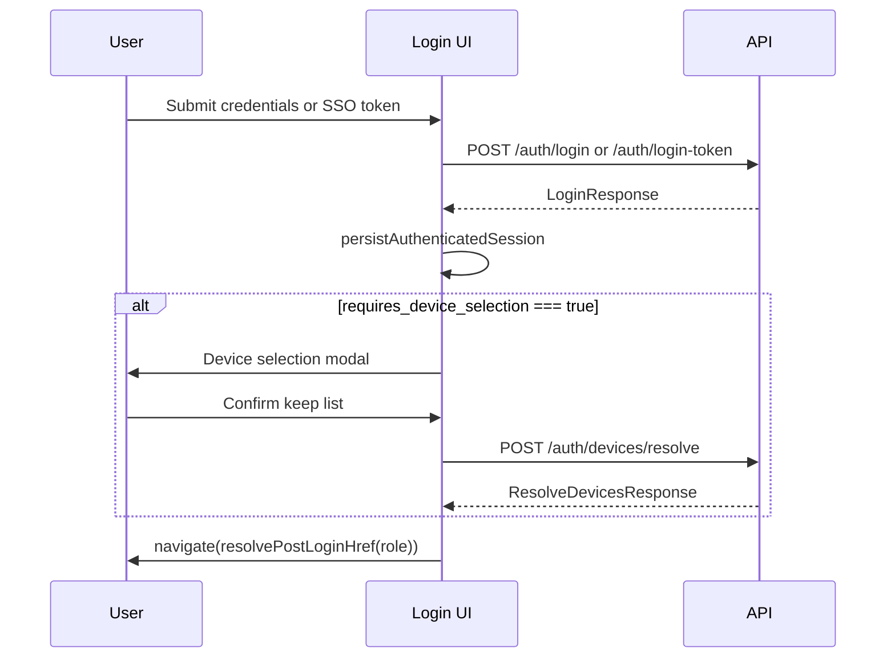

# Multi-login and device sessions — React frontend (API integration)

Use this document as the **single source of truth** for implementing device-session and multi-login UX in the Whirlpool Insights UI (`ui/`).

The frontend must **not** read or assume backend environment variables. All behavior is driven by **API responses and HTTP status codes** from OpenAPI (`ui/openapi.json`). Regenerate clients with `cd ui && pnpm api:sync`.

---

## Cursor agent instructions

Implement multi-login and device-session UX in the **React UI only** (`ui/`). Do not change API code unless explicitly asked.

**Before coding**

1. Run `cd ui && pnpm api:sync`.
2. Read existing patterns:
   - `ui/src/services/login-service.ts`
   - `ui/src/pages/auth/login.tsx`
   - `ui/src/lib/device-fingerprint.ts`
   - `ui/src/lib/session-device-uuid.ts`
   - `ui/src/pages/ops/account/page.tsx`

**Goals**

- Handle `LoginResponse` flags (`requires_device_selection`, `allow_multi_login`, `active_devices`).
- Complete SSO via `POST /auth/login-token` when the login URL has `?token=`.
- Manage devices via authenticated device endpoints.
- Use Orval-generated clients and types only.

**Do not**

- Branch on server env names or undocumented config.
- Skip `device` on `POST /auth/login` or `POST /auth/login-token`.
- Navigate home while `requires_device_selection === true`.
- Call `POST /auth/devices/resolve` when the latest `allow_multi_login` from the API is `true` (expect **400**).

**Conventions**

- shadcn, `sonner`, `@/endpoints` `PAGES`, lazy routes in `ui/src/router/index.tsx`.
- Thin pages; logic in `ui/src/services/` and `ui/src/components/auth/`.

---

## Frontend decision model (API fields only)

Use **response fields**, not deployment configuration.

| Source | Field | When `true` / populated | UI action |
|--------|--------|-------------------------|-----------|
| `LoginResponse` | `requires_device_selection` | After login | **Block** navigation; show device selection; then `POST /auth/devices/resolve` |
| `LoginResponse` | `requires_device_selection` | `false` | Persist session and navigate normally |
| `LoginResponse` | `allow_multi_login` | `true` | No blocking device modal at login; optional account “Devices” section |
| `LoginResponse` | `allow_multi_login` | `false` | Login may require selection; account copy: signing in elsewhere may prompt again |
| `LoginResponse` | `active_devices` | Non-empty at login | Render selection list (also available on `GET /auth/devices/active` later) |
| `ActiveDeviceListResponse` | `allow_multi_login` | Same semantics when refreshing device list | Gate resolve UI and help text |

```ts
function shouldShowDeviceSelection(login: LoginResponse): boolean {
  return login.requires_device_selection === true;
}

function canCallDeviceResolve(allowMultiLogin: boolean): boolean {
  return allowMultiLogin === false;
}
```

---

## Endpoints and schemas

### Authenticate

| Method | Path | Request body | Response |
|--------|------|--------------|----------|
| `POST` | `/auth/login` | `LoginRequest` | `LoginResponse` |
| `POST` | `/auth/login-token` | `LoginTokenRequest` | `LoginResponse` |

**`LoginRequest`**

```json
{
  "email": "user@example.com",
  "password": "secret",
  "device": { "...": "LoginDeviceInfo" }
}
```

**`LoginTokenRequest`**

```json
{
  "access_token": "<sso_exchange_token_from_query>",
  "device": { "...": "LoginDeviceInfo" }
}
```

**`LoginDeviceInfo`** (send on both login paths)

| Field | Type | Notes |
|-------|------|--------|
| `imei` | string | Client stable id (e.g. PWA id), 3–48 chars |
| `device_type` | `"desktop"` \| `"mobile"` | From existing `buildLoginDeviceInfo` |
| `device_fingerprint` | string | Persistent browser/device id |
| `device_info` | object | `userAgent`, `platform`, etc. |
| `current_lat` | number \| null | From geolocation when available |
| `current_lng` | number \| null | From geolocation when available |

**`LoginResponse`** (relevant fields)

| Field | Type | Frontend use |
|-------|------|----------------|
| `access_token` | string | Persist; set Axios `Authorization` |
| `token_type` | string | Usually `bearer` |
| `device_uuid` | string \| null | Store for push and device APIs; **must** be in `keep_device_uuids` when resolving |
| `role`, `allowed_warehouses`, … | — | Existing session / routing |
| `allow_multi_login` | boolean | Policy hint for copy and whether resolve is allowed |
| `requires_device_selection` | boolean | **Gate** post-login navigation |
| `active_devices` | `ActiveDeviceResponse[]` | Device selection modal |

**`ActiveDeviceResponse`**

| Field | Use in UI |
|-------|-----------|
| `uuid` | Checkbox value / deregister target |
| `display_label` | Primary label (prefer over fingerprint) |
| `is_current` | Badge “This device”; force checked on resolve |
| `has_active_session` | Badge “Signed in” |
| `device_type`, `last_seen_at` | Secondary info |
| `imei`, `device_fingerprint` | Debug / support only |

### Device management (Bearer required)

| Method | Path | Body | Response |
|--------|------|------|----------|
| `GET` | `/auth/devices/active` | — | `ActiveDeviceListResponse` |
| `POST` | `/auth/devices/resolve` | `ResolveDevicesRequest` | `ResolveDevicesResponse` |
| `POST` | `/auth/devices/{device_uuid}/deregister` | — | `DeregisterDeviceResponse` |

**`ResolveDevicesRequest`**

```json
{ "keep_device_uuids": ["uuid-1", "uuid-2"] }
```

- At least one UUID.
- Include `LoginResponse.device_uuid` (current session) so this browser stays valid.
- Call only when `allow_multi_login === false` (from login or `ActiveDeviceListResponse`).

**`ResolveDevicesResponse`**

```json
{
  "kept_device_uuids": ["..."],
  "deregistered_device_uuids": ["..."]
}
```

**`ActiveDeviceListResponse`**

```json
{
  "allow_multi_login": false,
  "devices": [ /* ActiveDeviceResponse[] */ ]
}
```

### Orval usage

```ts
import { getAuth } from "@/api/generated/auth/auth";

const auth = getAuth();
await auth.loginAuthLoginPost({ email, password, device });
await auth.loginTokenAuthLoginTokenPost({ access_token: ssoToken, device });
await auth.listActiveAuthDevicesAuthDevicesActiveGet();
await auth.resolveAuthDevicesAuthDevicesResolvePost({ keep_device_uuids });
await auth.deregisterAuthDeviceAuthDevicesDeviceUuidDeregisterPost(deviceUuid);
```

Types live under `ui/src/api/generated/model/`.

### SSO entry (URL contract only)

After Okta (or other SSO), the browser lands on the SPA with a **query parameter**:

```
/login?token=<exchange_token>
```

1. Read `token` from `location.search`.
2. Remove it from the URL immediately (`replace` navigation).
3. `POST /auth/login-token` with `{ access_token: token, device }`.
4. Run the **same** post-login pipeline as password login (session persist → device selection if `requires_device_selection` → navigate).

Okta redirect to API `GET /sso` is unchanged on the client; only handle the returned login URL with `token`.

---

## Post-login pipeline



**Order (required)**

1. Call login endpoint with `device`.
2. `persistAuthenticatedSession(login)` — sets bearer for subsequent calls.
3. If `login.requires_device_selection` → show modal → `resolve` with selected UUIDs.
4. Navigate to `resolvePostLoginHref(login.role)`.

Do not navigate at step 4 until step 3 succeeds when selection is required.

---

## Implementation plan

### 1. Extend `login-service.ts`

Keep `persistAuthenticatedSession` / `clearAuthenticatedSession` as the only session writers.

Suggested API:

```ts
export type CompleteLoginOptions = {
  coordinates: { lat: number; lng: number };
  ssoExchangeToken?: string;
  email?: string;
  password?: string;
};

export async function authenticateUser(
  options: CompleteLoginOptions,
): Promise<LoginResponse>;

export async function resolveLoginDevices(
  keepDeviceUuids: string[],
): Promise<ResolveDevicesResponse>;

export async function fetchActiveAuthDevices(): Promise<ActiveDeviceListResponse>;

export async function deregisterAuthDevice(deviceUuid: string): Promise<void>;

export async function completeLoginFlow(
  options: CompleteLoginOptions,
  resolveDevices?: (login: LoginResponse) => Promise<string[]>,
): Promise<LoginResponse>;
```

**Resolve UX**

- Pre-check `login.device_uuid`; disable unchecking current device.
- Unchecked devices are removed via resolve (API deregisters others).

**Errors**

- For 4xx, prefer `response.data.detail` when it is a **string** (role denied, inactive user, resolve validation).
- Keep generic copy for 401 on login; do not map every 403 to “Invalid email or password”.

### 2. `device-selection-dialog.tsx`

- Open when `requires_device_selection === true` after session persist.
- Data: `login.active_devices`.
- Confirm → `resolveLoginDevices(checkedUuids)` only if `!login.allow_multi_login`.
- Toast on failure; stay on modal.

### 3. `login.tsx`

- Password: `completeLoginFlow` with geolocation + `buildLoginDeviceInfo`.
- SSO: on mount, if `token` query → strip URL → login-token → same flow.
- Loading: “Completing sign-in…” for SSO path.

### 4. Account — devices section

- `GET /auth/devices/active` on load (authenticated).
- Use `ActiveDeviceListResponse.allow_multi_login` for help text.
- “Sign out device” on others → `POST .../deregister` with confirm.
- Current device: global logout (`clearAuthenticatedSession`) or deregister self → redirect login.

### 5. Session expiry (401)

If response body indicates revoked/expired session, `clearAuthenticatedSession()` and redirect to `PAGES.LOGIN` (wire in `axios-instance` if not already).

---

## Files to touch

| Action | Path |
|--------|------|
| Extend | `ui/src/services/login-service.ts` |
| Create | `ui/src/components/auth/device-selection-dialog.tsx` |
| Update | `ui/src/pages/auth/login.tsx` |
| Update | `ui/src/pages/ops/account/page.tsx` |
| Optional | `ui/src/pages/dashboard/settings/sessions/page.tsx` |
| Optional | `ui/src/api/axios-instance.ts` |
| Regenerate | `ui/src/api/generated/**` via `pnpm api:sync` |

---

## Testing checklist (observe via API responses)

**Device selection at login**

- [ ] Login returns `requires_device_selection: true` → modal shown; home not reached until resolve succeeds.
- [ ] Resolve body includes current `device_uuid`.
- [ ] After resolve, navigation works; second browser with dropped device gets 401 on API calls.

**No selection at login**

- [ ] Login returns `requires_device_selection: false` → no modal; direct navigation.

**`allow_multi_login: true`**

- [ ] No blocking modal at login.
- [ ] Resolve not called from login flow.
- [ ] Account lists devices; deregister other device succeeds.

**`allow_multi_login: false`**

- [ ] Account explains that another sign-in may prompt device choice.
- [ ] Resolve returns 400 if mistakenly called while API reports `allow_multi_login: true`.

**SSO**

- [ ] `/login?token=...` completes login-token flow and respects `requires_device_selection`.
- [ ] Token stripped from URL after read.
- [ ] Invalid token shows API `detail` or sensible fallback.

**Regression**

- [ ] `device` sent on both login paths; `device_uuid` persisted.
- [ ] Push subscription still uses stored `device_uuid`.
- [ ] Logout clears token and device uuid.

---

## Security (client)

- Strip `?token=` from the address bar after reading the SSO exchange token.
- Do not log `access_token` or exchange tokens.
- Use HTTPS in production; treat API `detail` strings as user-facing where appropriate.

---

## Related UI docs

- Push notifications: `docs/features/notification.md` (device uuid + subscribe after login)
